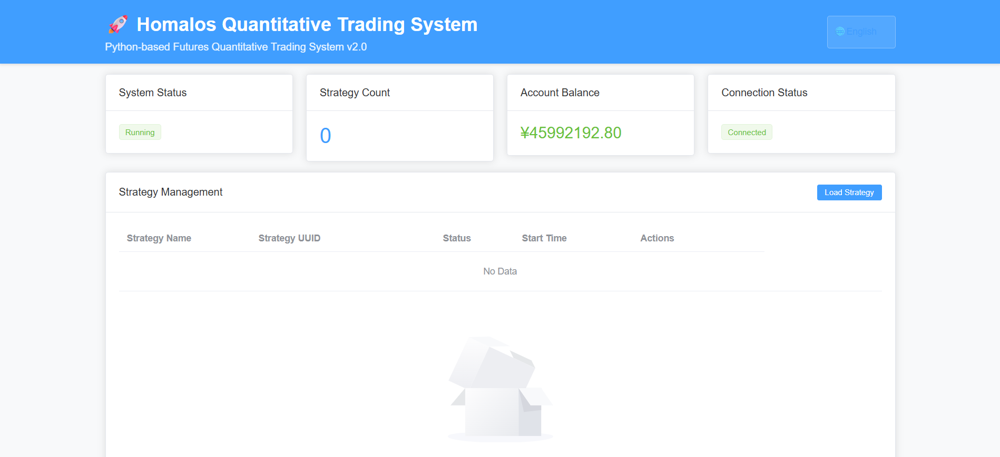

<div align="center">
  <a href="https://homalos.github.io" target="blank"></a>
</div>
<p>&nbsp;</p>

<p align="center">
  <font size="5px">✨ Python-based Futures Quantitative Trading System ✨</font>
</p>

<p align="center">
  <a href="https://img.shields.io/github/license/Homalos/Homalos"></a>
  <a href="https://img.shields.io/python/required-version-toml?tomlFilePath=https%3A%2F%2Fraw.githubusercontent.com%2FHomalos%2FHomalos%2Frefs%2Fheads%2Fmain%2Fpyproject.toml"></a>
  <a href="https://deepwiki.com/Homalos/Homalos"></a>
  <a href="https://qun.qq.com/universal-share/share?ac=1&authKey=dzGDk%2F%2Bpy%2FwpVyR%2BTrt9%2B5cxLZrEHL793cZlFWvOXuV5I8szMnOU4Wf3ylap7Ph0&busi_data=eyJncm91cENvZGUiOiI0NDYwNDI3NzciLCJ0b2tlbiI6IlFrM0ZhZmRLd0xIaFdsZE9FWjlPcHFwSWxBRFFLY2xZbFhaTUh4K2RldisvcXlBckZ4NVIrQzVTdDNKUFpCNi8iLCJ1aW4iOiI4MjEzMDAwNzkifQ%3D%3D&data=O1Bf7_yhnvrrLsJxc3g5-p-ga6TWx6EExnG0S1kDNJTyK4sV_Nd9m4p-bkG4rhj_5TdtS5lMjVZRBv4amHyvEA&svctype=4&tempid=h5_group_info"></a>
</p>

<p align="center">
  English |
  <a href="i18n/README_CN.md">简体中文</a>
</p>

## Overview

Homalos is a Python-based event-driven futures trading platform designed for standalone deployment with minimal external dependencies.

- **Current Status**: Core features completed, production ready
- **Core Features**: Real-time market data processing, intelligent risk control, strategy management, Web interface, performance monitoring, data center optimization

## Purpose

Homalos aims to be a production-ready quantitative trading system with the following key features:

- **Real-time Market Data Processing**: High-performance quote data processing and candlestick generation
- **Intelligent Risk Control**: Multi-dimensional risk management with real-time monitoring
- **Strategy Management**: Complete strategy lifecycle management with validation and health monitoring
- **Web Management Interface**: FastAPI backend with Vue.js frontend for system control
- **Performance Monitoring**: Real-time system metrics and alerting mechanisms

## Web management interface display



## System Features

1. **Technical Architecture**: Python EventBus-based synchronous + asynchronous event processing, modular monolithic architecture with clear separation of concerns
2. **Deployment Mode**: Standalone deployment, minimal external dependencies, no reliance on third-party middleware
3. **Multi-Interface Support**: Supports both CTP and TTS trading interfaces
4. **Strategy Framework**: Complete strategy lifecycle management
5. **Configuration-driven Design**: Flexible configuration file system
6. **Modern Toolchain**: Uses latest Python build and development tools
7. **Intelligent Monitoring**: Real-time performance monitoring and intelligent alerting system

## Overall Architecture

```reStructuredText
Homalos/
├── 📁 assets/                # Resource Files
├── 📁 config/                # Configuration files
├── 📁 data/                  # Data storage
├── 📁 docs/                  # System documentation
├── 📁 log/                   # Log storage
├── 📁 src/                   # Core source code directory
│   ├── 📁 config/            # Configuration management
│   ├── 📁 core/              # System core modules
│   ├── 📁 data_center/       # Data Center Module
│   ├── 📁 ctp/               # CTP interface module
│   ├── 📁 function/          # Core function
│   ├── 📁 services/          # Service modules
│   ├── 📁 strategies/        # Strategy instance
│   ├── 📁 strategy/          # Strategy Module
│   ├── 📁 trade/             # Trading Module
│   ├── 📁 tts/               # TTS interface module
│   ├── 📁 util/              # Utility modules
│   └── 📁 web/               # Web interface
└── 📁 tests/                 # Test script directory
```

## Core Technology Stack

**Build System:**

- **Meson + Ninja**: Modern C++ extension build system
- **Pybind11**: Python-C++ bindings
- **Hatch**: Python project management and packaging
- **uv**: Modern Python package manager providing faster installation and smarter dependency resolution

**Main Technologies:**

- **Application Framework**: FastAPI + WebSocket + Vue.js (Web API, real-time communication, and frontend)
- **Event Processing**: Custom EventBus (synchronous + asynchronous event-driven architecture)
- **Data Storage**: SQLite + WAL mode (high-performance local database)
- **Trading Interface**: CTP API (futures trading standard interface)
- **Data Processing**: NumPy, Pandas, Polars
- **Technical Analysis**: TA-Lib
- **Logging System**: Loguru (structured log processing)

## Core Module Details

### 1. **Core Module** (`src/core/`)

- **event.py**: Event objects
- **event_bus.py**: High-performance event bus
- **gateway.py**: Abstract gateway class
- **object.py**: Basic data structures
- **logger.py**: Logging module
- **service_registry.py**: Service registry

### 2. **Services Module** (`src/services/`)

- **trading_engine.py**: Trading engine core
- **data_service.py**: Unified data service
- **performance_monitor.py**: Performance monitor

### 3. **Strategy Module** (`src/strategies/`)

- **base_strategy.py**: Strategy base class
- **grid_trading_strategy.py**: Grid trading strategy
- **minimal_strategy.py**: Minimal strategy example
- **moving_average_strategy.py**: Moving average strategy
- **strategy_factory.py**: Strategy factory
- **strategy_template.py**: Strategy development template

### 4. **Trading Interface Modules**

- **CTP Module** (`src/ctp/`): Shanghai Futures Exchange CTP interface
- **TTS Module** (`src/tts/`): TTS trading interface

Both modules include:

- `api/`: C++ extension modules (.pyd files)
- `gateway/`: Python gateway implementation
- `meson.build`: Build configuration

### 5. **Configuration System** (`config/`)

- **2024/2025_holidays.json**: Trading calendar
- **brokers.json.example**: Broker configuration template
- **instrument_exchange_id.json**: Contract exchange mapping
- **log_config.yaml**: Global logging configuration
- **product_info.ini**: Product information
- **system.yaml.example**: Global system configuration template
- **test_system.yaml.example**: Test mode global system configuration template

## Build System Features

1. **Unified Build**: Uses Meson build system to manage C++ extensions
2. **Cross-platform Support**: Windows/Linux
3. **Incremental Compilation**: Supports fast rebuilds
4. **One-click Build**: `python build.py`

## Build Process

Remove old builds:

```bash
rmdir /s /q build
```

Third-party extension build:

```bash
meson compile -C build
```

This project uses `meson-python` as the build backend

## Major Achievements

**✅ Established unified build architecture:**

- Root directory main `meson.build` manages unified project configuration
- Submodule `meson.build` focuses on module-specific configuration
- Unified `build.py` script simplifies build process
- Cross-platform support (Windows/Linux)

## Build Process Verification

Homalos quantitative trading system's unified build system supports incremental compilation and one-click build

```bash
# Simple one-click build command
python build.py
```

**✅ Successfully generated extension modules:**

- `src/ctp/api/ctpmd.cp312-win_amd64.pyd`
- `src/ctp/api/ctptd.cp312-win_amd64.pyd`
- `src/tts/api/ttsmd.cp312-win_amd64.pyd`
- `src/tts/api/ttstd.cp312-win_amd64.pyd`

## Technical Details

**Configuration Files:**

- ✅ `meson.build` (root directory main build script)
- ✅ `src/ctp/meson.build` (CTP module configuration)
- ✅ `src/tts/meson.build` (TTS module configuration)
- ✅ `build.py` (unified build script)

**Compilation Environment:**

- Windows 10 + MSVC 2022
- Python 3.12 virtual environment
- Meson 1.8.1 + Ninja build system
- Pybind11 for Python-C++ bindings

## System Core Components

- Configuration Manager ✅
- Event Bus ✅
- Data Service ✅
- Trading Engine Core ✅
- Performance Monitor ✅
- Web Management Interface ✅
- WebSocket Real-time Connection ✅

## System Completion Progress

### ✅ Completed Core Features

#### 1. Infrastructure Layer (100% Complete)

- Event Bus: Supports async/sync dual-channel processing, event monitoring and statistics ✅
- Configuration Management: Supports hot reload, layered configuration, environment adaptation ✅
- Logging System: Structured logging, multi-level output, file rotation ✅
- Service Registry: Component registration and discovery mechanism ✅

#### 2. Data Service Layer (100% Complete)

- Database Management: SQLite storage, WAL mode, batch writing ✅
- Market Data Processing: Tick data caching, real-time distribution, persistence ✅
- Bar Generator: Multi-timeframe candlestick generation, incremental updates ✅
- Historical Data Query: Asynchronous queries, data indexing ✅

#### 3. Trading Engine Core (95% Complete)

- Strategy Management: Dynamic loading, lifecycle management, auto-discovery ✅
- Risk Management: Parallel checking, multi-dimensional limits, real-time monitoring ✅
- Order Management: State machine management, simulated execution, cancellation support ✅
- Account Management: Position tracking, P&L calculation, fund management ✅

#### 4. Strategy Framework (100% Complete)

- BaseStrategy: Complete strategy base class, event-driven design ✅
- Strategy Lifecycle: Initialize→Start→Run→Stop ✅
- Market Data Subscription: Dynamic subscription, cache management, event distribution ✅
- Trading Interface: Order placement, cancellation, position queries ✅
- Strategy Templates: Complete strategy development framework and examples ✅

#### 5. Web Management Interface (100% Complete)

- REST API: Strategy management, system monitoring, configuration management ✅
- WebSocket: Real-time data push, strategy operation events, status updates ✅
- Frontend Interface: Strategy management optimization, UUID auto-generation, real-time log feedback ✅
- User Experience: Simplified operation flow, table layout optimization, real-time operation feedback ✅

#### 6. Performance Monitoring (100% Complete)

- Real-time Monitoring: Latency, throughput, resource usage ✅
- Alert System: Threshold monitoring, event notifications, multi-level alerts ✅
- Performance Testing: Benchmarking, stress testing, end-to-end testing ✅

#### 7. CTP Gateway Integration (100% Complete)

- Market Data Gateway: Real-time data reception, connection management ✅
- Trading Gateway: Order execution, status synchronization ✅
- Auto-reconnection: Intelligent reconnection, fault recovery ✅
- Event Integration: Dynamic subscription, status broadcasting ✅
- Thread Safety: CTP API callback thread-safe bridging ✅

#### 8. Data Center Optimization (100% Complete)

- Table Cache Mechanism: Data type isolation, race condition fixes ✅
- Batch Write Optimization: Independent tick and bar data management ✅
- Database Isolation: Independent table creation status tracking for multiple databases ✅
- Concurrency Safety: Safe data writing in multi-threaded environments ✅

## Technical Implementation Highlights

### Event-Driven Architecture

- **Loose Coupling Design**: Modules communicate through events, reducing dependencies
- **Asynchronous Processing**: Non-blocking event processing improves system responsiveness
- **Extensibility**: New modules can easily integrate into the event bus
- **Real-time Push**: WebSocket event push 100% success rate, latency <200ms

### Data Processing Optimization

- **Batch Write Mechanism**: Memory batch accumulation, 5-second interval batch writing
- **Caching Strategy**: Multi-level caching, independent cache space for each strategy
- **WAL Mode**: Write-ahead logging ensures data safety

### Gateway Integration Enhancement

- **CTP Gateway Optimization**: Auto-reconnection, connection pooling, heartbeat monitoring
- **Event Integration**: Dynamic subscription, status synchronization, error handling
- **Thread Safety**: Resolves thread safety issues in C++/Python mixed environments

### User Experience Optimization

- **UUID Auto-generation**: Simplifies strategy loading process, improves operation convenience
- **Real-time Feedback Mechanism**: Immediate log feedback for strategy operations, enhances observability
- **Interface Optimization**: Streamlined table layout, improved information display efficiency
- **Debug-friendly**: Complete event flow debug logs for easy troubleshooting
- **JSON Serialization Enhancement**: Robust handling of complex objects in WebSocket events, supports enum, dataclass, datetime objects
- **Data Center Stability**: Fixed table cache race conditions, ensuring normal tick and bar data writing
- **Thread Safety Optimization**: Safe bridging between CTP API callbacks and Python event loops

## Deployment and Operations

### System Requirements

#### Hardware Configuration

```yaml
Minimum Requirements:
  CPU: 2-core 2.4GHz
  Memory: 2GB RAM
  Storage: 10GB SSD

Recommended Configuration:
  CPU: 4-core 3.0GHz+
  Memory: 8GB+ RAM
  Storage: 50GB+ SSD
```

#### Software Environment

```bash
# Base Environment
Python: 3.10+
Operating System: Windows 10+ / Linux
Database: SQLite (built-in)
```

### Quick Start

#### 1. Environment Setup

```bash
# Activate virtual environment
.venv\Scripts\activate  # Windows
source .venv/bin/activate  # Linux

# One-click install all dependencies
uv sync
# Install individual dependency (optional command)
uv add <package_name>
```

#### 2. Configuration Setup

```bash
# Copy configuration file
cp config/system.yaml.example config/system.yaml

# Modify key configurations
# - CTP account information (user_id, password)
# - Risk control parameters
# - Web port settings
```

#### 3. Start System

```bash
# Start Homalos data center
python -m start_data_center
# Start Homalos trading system
python -m start_homalos
```

#### 4. Verify Operation

```bash
# Check Web interface
Access: http://127.0.0.1:8000

# Test API endpoints
curl http://127.0.0.1:8000/api/v1/system/status

# Strategy management
curl http://127.0.0.1:8000/api/v1/strategies
```

## Development Guide

### Strategy Development

```python
# 1. Inherit strategy base class
from src.strategies.base_strategy import BaseStrategy

class MyStrategy(BaseStrategy):
    def __init__(self, strategy_id: str, event_bus: EventBus):
        super().__init__(strategy_id, event_bus)
    
    async def on_tick(self, tick_data: TickData):
        # Implement strategy logic
        pass
```

## Future Development Plans

### P1 High Priority

- **Strategy Backtesting Engine**: Historical data validation and performance evaluation
- **Visualization**: Visualization of the trading process, including: chart marking of buy and sell transaction points, order list display (order number, transaction time, type, number of lots, transaction type, price, stop loss price, take profit price, handling fee)

### P2 Low Priority

- **Enterprise Features**: Multi-account support and permission management

## Reference Resources

### Technical Documentation

- [System Planning Document](docs/system_plan.md)
- [Strategy Development Guide](docs/strategy_development_guide.md)
- [Strategy Enhancement Features Documentation](docs/strategy_enhancement_plan.md)
- [API Interface Documentation](http://127.0.0.1:8000/docs)
- [Project Progress Overview](docs/project_completion_summary.md)
- [Issue Fix History](CHANGELOG.md)

### Community Support

- **Project Manual**: [homalos.github.io](https://homalos.github.io/)
- **Wiki**: [DeepWiki](https://deepwiki.com/Homalos/Homalos)
- **Technical Exchange (QQ Group)**: `446042777`
- **Issue Feedback**: GitHub Issues

## Disclaimer

[Disclaimer content](docs/Disclaimer.md)

---

*Homalos Quantitative Trading System - From Concept to Production*
*Project Status: Under development | Last Updated: 2025-07-25*
