<div align="center">
  <a href="https://homalos.github.io" target="blank"></a>
</div>
<p>&nbsp;</p>

<p align="center">
  <font size="5px">✨ Python-based Futures Quantitative Trading System ✨</font>
</p>

<p align="center">
  <a href="https://img.shields.io/github/license/Homalos/Homalos"></a>
  <a href="https://img.shields.io/python/required-version-toml?tomlFilePath=https%3A%2F%2Fraw.githubusercontent.com%2FHomalos%2FHomalos%2Frefs%2Fheads%2Fmain%2Fpyproject.toml"></a>
  <a href="https://deepwiki.com/Homalos/Homalos"></a>
  <a href="https://qun.qq.com/universal-share/share?ac=1&authKey=dzGDk%2F%2Bpy%2FwpVyR%2BTrt9%2B5cxLZrEHL793cZlFWvOXuV5I8szMnOU4Wf3ylap7Ph0&busi_data=eyJncm91cENvZGUiOiI0NDYwNDI3NzciLCJ0b2tlbiI6IlFrM0ZhZmRLd0xIaFdsZE9FWjlPcHFwSWxBRFFLY2xZbFhaTUh4K2RldisvcXlBckZ4NVIrQzVTdDNKUFpCNi8iLCJ1aW4iOiI4MjEzMDAwNzkifQ%3D%3D&data=O1Bf7_yhnvrrLsJxc3g5-p-ga6TWx6EExnG0S1kDNJTyK4sV_Nd9m4p-bkG4rhj_5TdtS5lMjVZRBv4amHyvEA&svctype=4&tempid=h5_group_info"></a>
</p>

<p align="center">
  English |
  <a href="i18n/README_CN.md">简体中文</a>
</p>

## Overview

This project is a new development fork of Homalos, a Python-based event-driven futures trading platform designed to be deployed on a single machine with minimal external dependencies.

- **Current Status**: Under development

## Features

- ✅ Event-driven architecture
- ✅ CTP-API (Comprehensive trading platform API) integration
- ✅ Real-time market data processing
- ✅ K-line data generation (1m, 3m, 5m, 15m, 30m, 60m)
- ✅ **Web Management Interface** (FastAPI + Vue 3)
  - User authentication (JWT)
  - System monitoring dashboard
  - Strategy management with detailed panel
  - Task scheduler
  - Notification center
  - Data center control via Web API
  - Real-time data visualization

## Web Interface

Homalos now includes a modern web management interface built with FastAPI and Vue 3.

### Interface Screenshots

Login

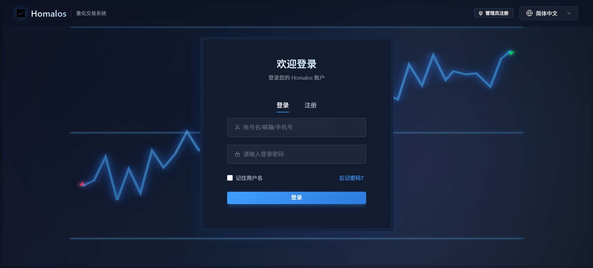

User Registration

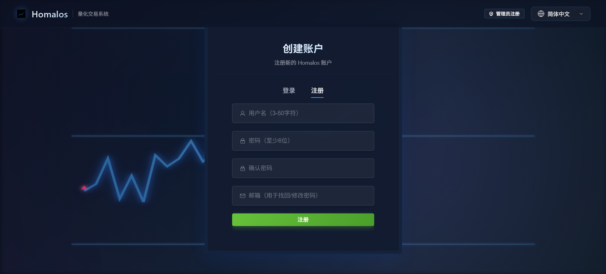

Admin Registration

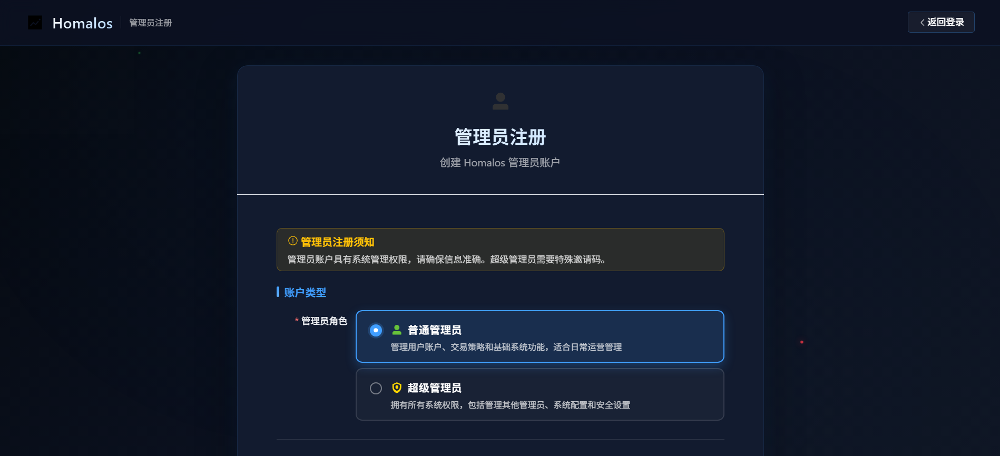

Brokerage Account Login

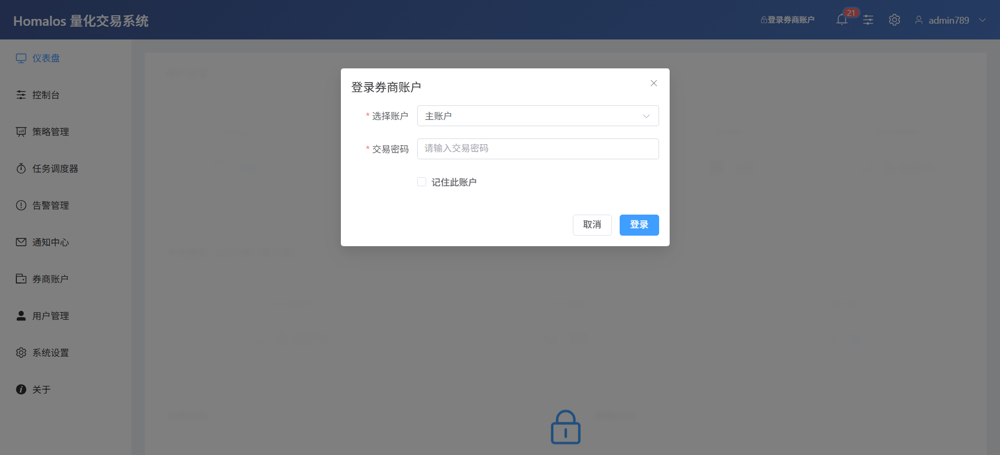

Console

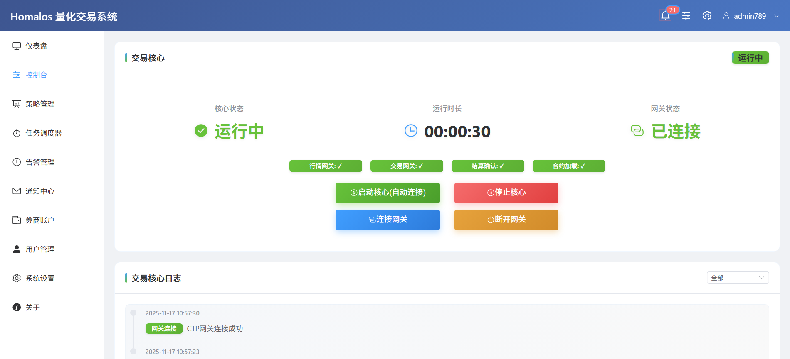

Strategy Management

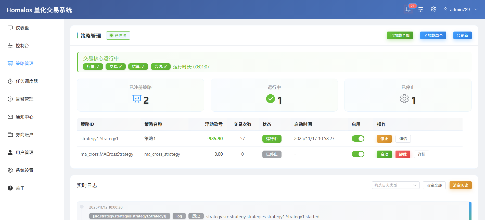

Strategy Loading

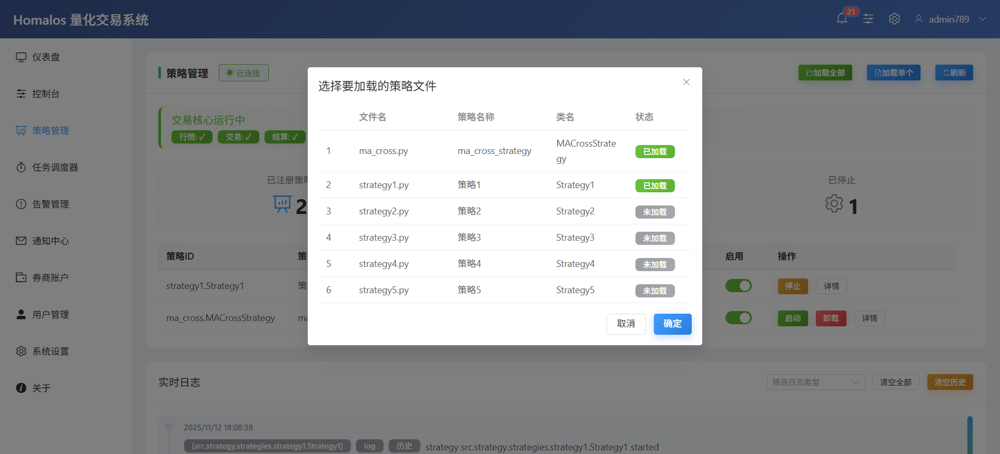

Dashboard 1

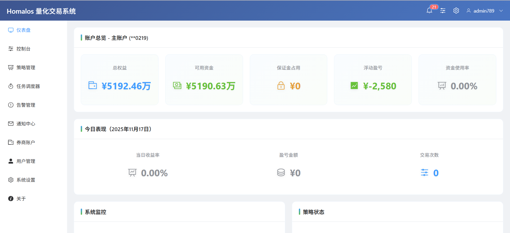

Dashboard 2

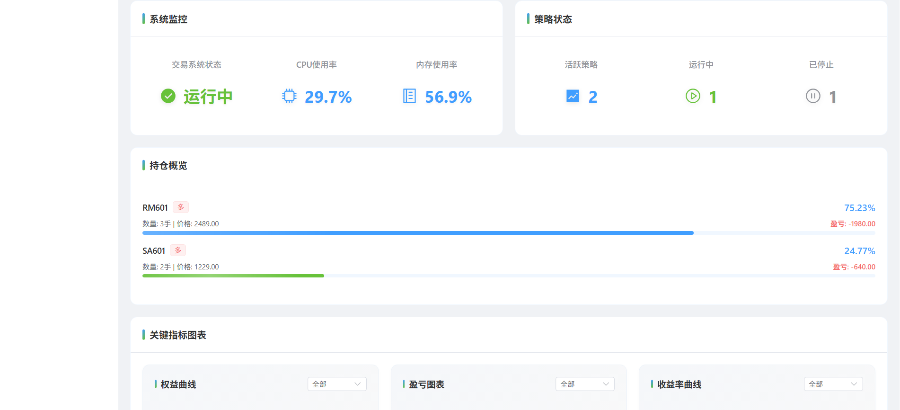

Task Scheduler

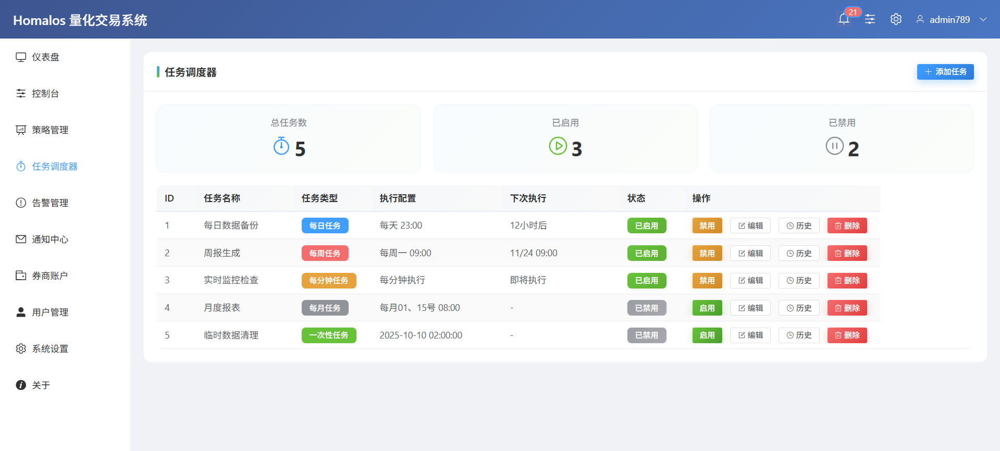

Alarm Management

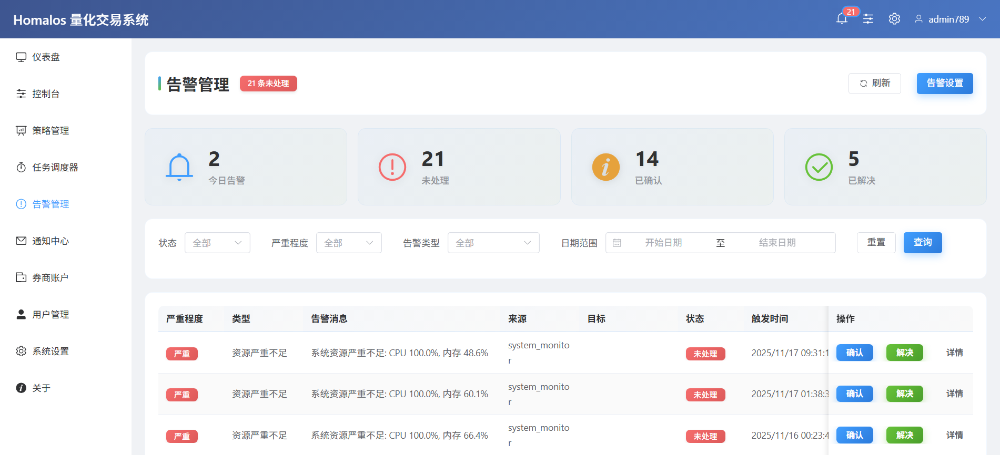

Notification Center

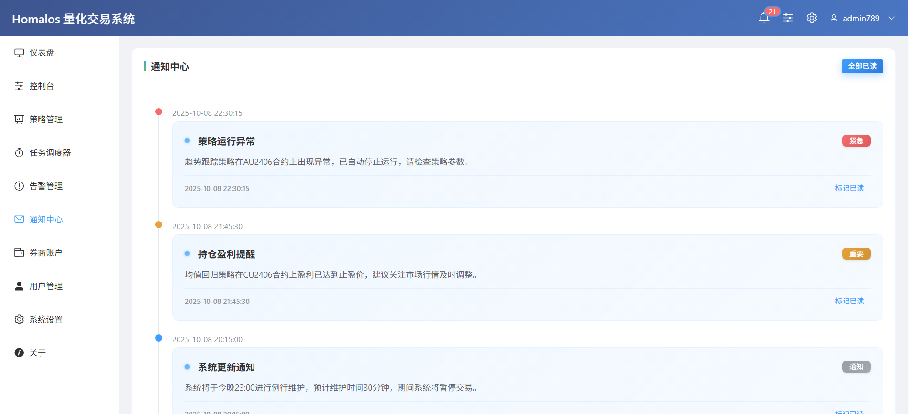

Brokerage Account Management

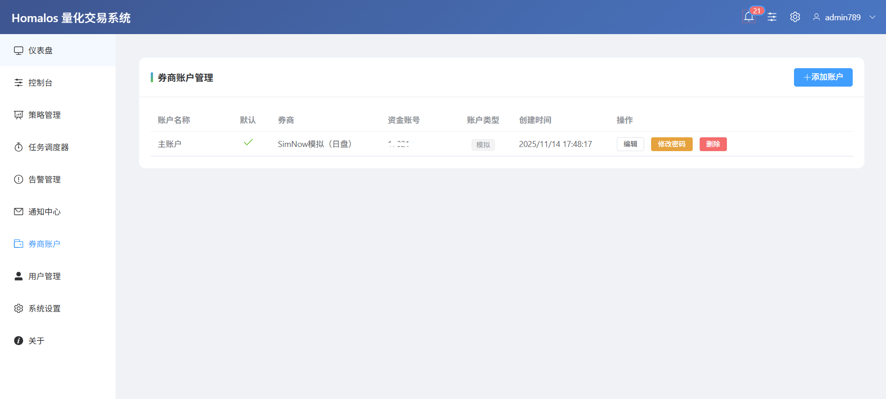

User Management (Admin Feature)

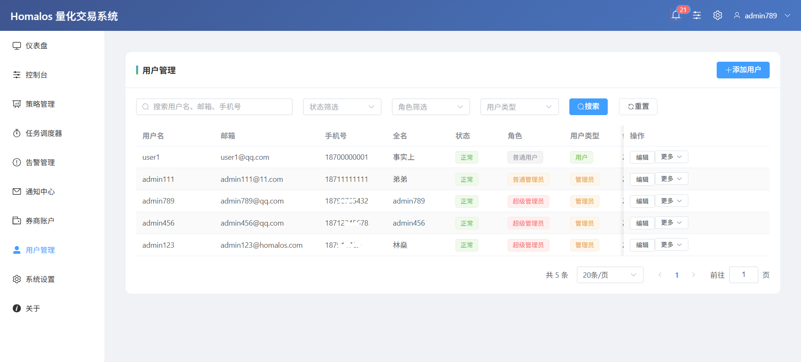

System Settings

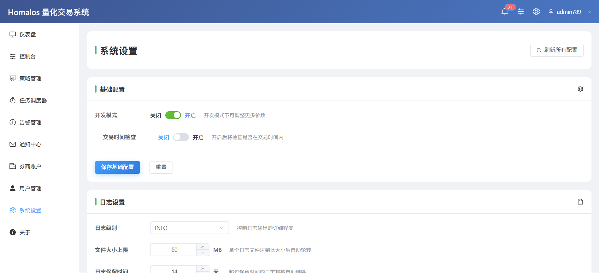

About

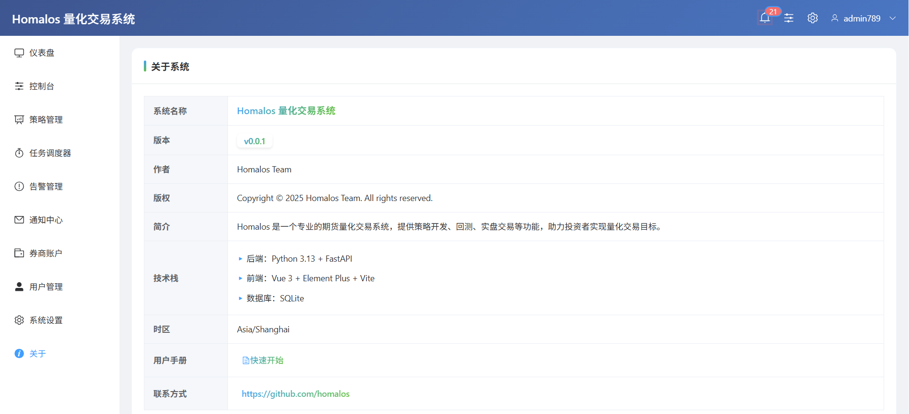

Personal Center

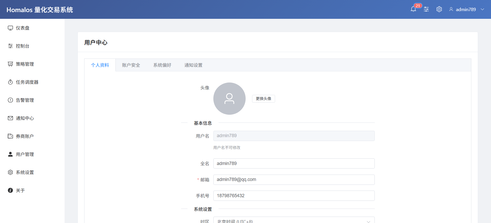


### Quick Start

1. **Initialize the super administrator account**
   
   ```bash
   init_admin.bat
   ```
Default credentials: `admin` / `Admin@123456`
   
2. **Start All Services**
   
   ```bash
   start_all_web.bat
   ```
This will start both backend (port 8000) and frontend (port 5173)
   
3. **Access Web Interface**
   - Frontend: http://localhost:5173
   - API Docs: http://localhost:8000/docs

### Tech Stack

**Backend:**
- FastAPI
- SQLAlchemy 2.0 + SQLite
- JWT Authentication
- Argon2 Password Hashing

**Frontend:**
- Vue 3 + Vite
- Element Plus UI
- Vue Router 4
- Pinia State Management
- Axios

### Documentation

See [Web System Guide](docs/Web系统使用指南.md) for detailed documentation.

### Strategy Management

**⚠️ Important: Strategy Hot Reload is Disabled**

For safety reasons, strategy hot reload has been disabled in production environments. Modifying running strategies could lead to:

- Loss of position state
- Loss of order state  
- Interrupted trading logic

**Safe Strategy Modification Process:**

1. Stop the strategy in the Strategy Management panel
2. Confirm the strategy status is "Stopped"
3. Edit your strategy code in `src/strategy/strategies/`
4. Save the file (the strategy will NOT auto-start)
5. (Optional) Run unit tests to verify your changes
6. Click "Start" button to run the modified strategy

**Why no hot reload?**

- Current system lacks position/order synchronization with CTP Gateway
- Missing order callback routing to strategy processes
- State persistence doesn't include trading information
- Risk of duplicate orders or position inconsistencies

This follows industry best practices (vnpy, Zipline) where code changes require explicit restarts.

## Installation

```bash
# Clone repository
git clone https://github.com/Homalos/Homalos.git
cd Homalos

# Install Python dependencies
.venv\Scripts\activate
uv sync

# Install frontend dependencies
cd web-ui
npm install
cd ..
```

## License

MIT License
