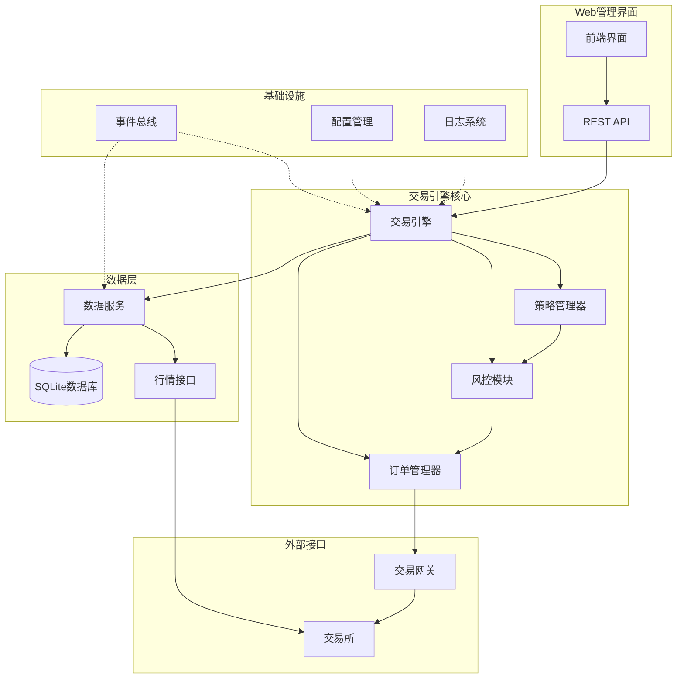
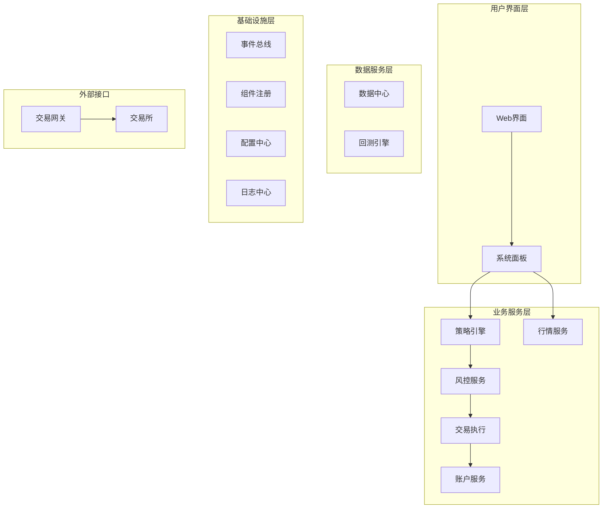

# 基于Python的期货量化交易系统设计方案（v2.0）

## 1. 设计目标

- **高性能**：支持处理高频行情和快速交易执行
- **低延迟**：基于事件驱动的高性能架构
- **模块化**：松耦合的模块化设计，便于维护和扩展  
- **动态性**：支持策略实例的动态加载和卸载
- **可观测性**：完整的监控和日志跟踪体系
- **实用性**：优先保证核心交易功能的稳定性和性能
- **自包含**：单机部署，最小化外部依赖

---

## 2. 系统架构概述

### 2.1 MVP架构设计（推荐实施）

考虑到开发效率和系统复杂度，我们采用**模块化单体架构**作为MVP实现：



### 2.2 目标架构设计（未来扩展）

为系统未来发展保留的完整微服务架构：



---

## 3. 核心模块划分（MVP架构）

### 3.1 模块简化对比

| 原设计模块 | MVP合并策略 | 原因 |
|:-----------|:------------|:-----|
| 策略引擎 + 风控服务 + 交易执行 | → 交易引擎核心 | 减少服务间通信延迟，简化部署 |
| 行情服务 + 数据中心 | → 数据服务 | 统一数据管理，避免重复存储 |
| 系统面板 + 配置中心 + 日志中心 | → Web管理界面 + 基础设施 | 简化运维复杂度 |
| 账户服务 | → 交易引擎核心 | 账户状态与交易执行紧密耦合 |

### 3.2 MVP核心模块

| 模块名称 | 核心职责 | 实现优先级 |
|:---------|:---------|:-----------|
| **交易引擎核心** | 策略执行、风控检查、订单管理、账户跟踪 | P0 |
| **数据服务** | 行情接收、数据存储、历史数据查询 | P0 |  
| **Web管理界面** | 策略管理、系统监控、参数配置 | P1 |
| **基础设施** | 事件总线、配置管理、日志系统 | P0 |

---

## 4. 基础设施模块设计

### 4.1 事件总线（基于现有实现优化）

#### 4.1.1 现有实现优势
```python
# 现有EventBus已实现的核心功能
class EventBus:
    - 同步/异步双通道处理
    - 线程池管理和资源清理
    - 事件监控和统计
    - 优雅关闭机制
```

#### 4.1.2 建议优化
```python
# 添加事件优先级和背压控制
class PriorityEvent(Event):
    def __init__(self, event_type: str, data: Any, priority: int = 0):
        super().__init__(event_type, data)
        self.priority = priority  # 0=highest, 9=lowest

# 事件主题分类
TRADING_EVENTS = [
    "order.new", "order.cancel", "order.filled",
    "risk.check", "position.update"
]

MARKET_EVENTS = [
    "market.tick", "market.bar", "market.subscribe"
]

SYSTEM_EVENTS = [
    "strategy.start", "strategy.stop", "system.shutdown"
]
```

### 4.2 组件注册（简化服务发现）

```python
class ComponentRegistry:
    """轻量级组件注册，替代重量级服务发现"""
    
    def __init__(self):
        self.components = {}
        self.event_bus = None
    
    def register(self, name: str, component: Any, capabilities: list = None):
        """注册组件"""
        self.components[name] = {
            'instance': component,
            'capabilities': capabilities or [],
            'register_time': time.time()
        }
        
    def get_component(self, name: str):
        """获取组件实例"""
        return self.components.get(name, {}).get('instance')
    
    def list_capabilities(self, capability: str):
        """按能力查找组件"""
        return [name for name, info in self.components.items() 
                if capability in info.get('capabilities', [])]
```

### 4.3 配置管理（简化版）

```python
class ConfigManager:
    """简化的配置管理，支持热重载"""
    
    def __init__(self, config_file: str):
        self.config_file = config_file
        self.config = {}
        self.watchers = defaultdict(list)
        self.load_config()
    
    def get(self, key: str, default=None):
        """获取配置值，支持点号分隔的路径"""
        keys = key.split('.')
        value = self.config
        for k in keys:
            if isinstance(value, dict) and k in value:
                value = value[k]
            else:
                return default
        return value
    
    def watch(self, key_pattern: str, callback: Callable):
        """监听配置变更"""
        self.watchers[key_pattern].append(callback)
    
    def reload(self):
        """热重载配置"""
        old_config = self.config.copy()
        self.load_config()
        self._notify_changes(old_config, self.config)
```

---

## 5. 交易引擎核心设计

### 5.1 整体架构

```python
class TradingEngine:
    """交易引擎核心 - 集成策略、风控、订单管理"""
    
    def __init__(self, event_bus: EventBus):
        self.event_bus = event_bus
        self.strategy_manager = StrategyManager(event_bus)
        self.risk_manager = RiskManager(event_bus)
        self.order_manager = OrderManager(event_bus)
        self.account_manager = AccountManager(event_bus)
        
        # 注册事件处理器
        self._setup_event_handlers()
    
    def _setup_event_handlers(self):
        """设置事件处理器链"""
        # 策略信号 -> 风控检查 -> 订单执行
        self.event_bus.subscribe("strategy.signal", self._handle_strategy_signal)
        self.event_bus.subscribe("risk.approved", self._handle_risk_approved)
        self.event_bus.subscribe("order.filled", self._handle_order_filled)
```

### 5.2 策略管理器

```python
class StrategyManager:
    """策略管理器 - 基于现有BaseStrategy优化"""
    
    def __init__(self, event_bus: EventBus):
        self.event_bus = event_bus
        self.strategies = {}  # strategy_id -> strategy_instance
        self.strategy_states = {}  # strategy_id -> state
        
    async def load_strategy(self, strategy_path: str, strategy_id: str, params: dict):
        """动态加载策略"""
        try:
            # 使用importlib动态导入
            spec = importlib.util.spec_from_file_location("strategy", strategy_path)
            module = importlib.util.module_from_spec(spec)
            spec.loader.exec_module(module)
            
            # 创建策略实例
            strategy_class = getattr(module, 'Strategy')  # 约定策略类名为Strategy
            strategy = strategy_class(strategy_id, self.event_bus, params)
            
            self.strategies[strategy_id] = strategy
            self.strategy_states[strategy_id] = 'loaded'
            
            # 发布策略加载事件
            self.event_bus.publish(Event("strategy.loaded", {
                "strategy_id": strategy_id,
                "strategy_name": strategy.strategy_name
            }))
            
        except Exception as e:
            logger.error(f"Failed to load strategy {strategy_id}: {e}")
            raise
```

### 5.3 风控管理器

```python
class RiskManager:
    """增强的风控管理器"""
    
    def __init__(self, event_bus: EventBus):
        self.event_bus = event_bus
        self.rules = self._load_risk_rules()
        self.position_tracker = {}
        self.daily_stats = {}
        
    def _load_risk_rules(self) -> dict:
        """加载风控规则"""
        return {
            'max_position_size': 1000000,  # 最大持仓金额
            'max_daily_loss': 50000,       # 单日最大亏损
            'max_order_size': 100,         # 单笔最大手数
            'order_frequency_limit': 10,   # 每秒最大订单数
            'position_concentration': 0.3, # 单品种最大仓位比例
        }
    
    async def check_order(self, order_signal: dict) -> bool:
        """并行风控检查"""
        checks = await asyncio.gather(
            self._check_position_limit(order_signal),
            self._check_daily_loss_limit(order_signal),
            self._check_order_size(order_signal),
            self._check_frequency_limit(order_signal),
            return_exceptions=True
        )
        
        # 所有检查都必须通过
        passed = all(isinstance(result, bool) and result for result in checks)
        
        if passed:
            self.event_bus.publish(Event("risk.approved", order_signal))
        else:
            self.event_bus.publish(Event("risk.rejected", {
                "order": order_signal,
                "reasons": [str(r) for r in checks if not isinstance(r, bool) or not r]
            }))
        
        return passed
```

### 5.4 订单管理器

```python
class OrderManager:
    """订单管理器 - 状态机设计"""
    
    def __init__(self, event_bus: EventBus, gateway):
        self.event_bus = event_bus
        self.gateway = gateway
        self.orders = {}  # order_id -> order_data
        self.order_states = {}  # order_id -> state
        
    async def place_order(self, order_data: dict):
        """下单"""
        order_id = self._generate_order_id()
        order_data['order_id'] = order_id
        
        # 状态机：PENDING -> SUBMITTED -> FILLED/CANCELLED
        self.order_states[order_id] = 'PENDING'
        self.orders[order_id] = order_data
        
        try:
            # 发送到交易网关
            await self.gateway.send_order(order_data)
            self.order_states[order_id] = 'SUBMITTED'
            
            self.event_bus.publish(Event("order.submitted", order_data))
            
        except Exception as e:
            self.order_states[order_id] = 'FAILED'
            self.event_bus.publish(Event("order.failed", {
                "order_id": order_id,
                "error": str(e)
            }))
```

---

## 6. 数据服务设计

### 6.1 统一数据服务

```python
class DataService:
    """统一的数据服务 - 整合行情和存储"""
    
    def __init__(self, event_bus: EventBus):
        self.event_bus = event_bus
        self.market_gateway = None
        self.db_manager = DatabaseManager()
        self.tick_buffer = {}  # 内存缓冲
        self.subscribers = defaultdict(set)  # symbol -> set(strategy_ids)
        
    async def subscribe_market_data(self, symbols: list, strategy_id: str):
        """订阅行情数据"""
        for symbol in symbols:
            self.subscribers[symbol].add(strategy_id)
            
        # 只对新合约发起真实订阅
        new_symbols = [s for s in symbols if s not in self.tick_buffer]
        if new_symbols:
            await self.market_gateway.subscribe(new_symbols)
    
    def on_tick_data(self, tick_data: dict):
        """处理实时行情"""
        symbol = tick_data['symbol']
        
        # 更新内存缓冲
        self.tick_buffer[symbol] = tick_data
        
        # 分发给订阅的策略
        for strategy_id in self.subscribers.get(symbol, set()):
            self.event_bus.publish(Event(f"market.tick.{strategy_id}", tick_data))
        
        # 异步持久化（不阻塞实时处理）
        self.event_bus.publish(Event("data.persist", tick_data), is_async=True)
```

### 6.2 数据库管理

```python
class DatabaseManager:
    """简化的数据库管理"""
    
    def __init__(self, db_path: str = "data/trading.db"):
        self.db_path = db_path
        self.connection_pool = self._create_connection_pool()
        self._init_tables()
    
    def _init_tables(self):
        """初始化数据表"""
        tables = {
            'tick_data': '''
                CREATE TABLE IF NOT EXISTS tick_data (
                    symbol TEXT,
                    datetime TEXT,
                    last_price REAL,
                    volume INTEGER,
                    turnover REAL,
                    open_interest INTEGER,
                    PRIMARY KEY (symbol, datetime)
                )
            ''',
            'orders': '''
                CREATE TABLE IF NOT EXISTS orders (
                    order_id TEXT PRIMARY KEY,
                    strategy_id TEXT,
                    symbol TEXT,
                    direction TEXT,
                    offset TEXT,
                    price REAL,
                    volume INTEGER,
                    status TEXT,
                    create_time TEXT,
                    update_time TEXT
                )
            ''',
            'positions': '''
                CREATE TABLE IF NOT EXISTS positions (
                    strategy_id TEXT,
                    symbol TEXT,
                    direction TEXT,
                    volume INTEGER,
                    price REAL,
                    pnl REAL,
                    update_time TEXT,
                    PRIMARY KEY (strategy_id, symbol, direction)
                )
            '''
        }
        
        with sqlite3.connect(self.db_path) as conn:
            for table_name, sql in tables.items():
                conn.execute(sql)
            conn.commit()
    
    async def save_tick_data(self, tick_data: dict):
        """异步保存tick数据"""
        # 使用批量插入提高性能
        if not hasattr(self, '_tick_batch'):
            self._tick_batch = []
        
        self._tick_batch.append(tick_data)
        
        # 达到批次大小时批量写入
        if len(self._tick_batch) >= 100:
            await self._flush_tick_batch()
    
    async def _flush_tick_batch(self):
        """批量写入tick数据"""
        if not self._tick_batch:
            return
            
        sql = '''
            INSERT OR REPLACE INTO tick_data 
            (symbol, datetime, last_price, volume, turnover, open_interest)
            VALUES (?, ?, ?, ?, ?, ?)
        '''
        
        data = [
            (t['symbol'], t['datetime'], t['last_price'], 
             t['volume'], t['turnover'], t.get('open_interest', 0))
            for t in self._tick_batch
        ]
        
        with sqlite3.connect(self.db_path) as conn:
            conn.executemany(sql, data)
            conn.commit()
        
        self._tick_batch.clear()
```

---

## 7. Web管理界面设计

### 7.1 REST API设计

```python
from fastapi import FastAPI, WebSocket, HTTPException
from fastapi.staticfiles import StaticFiles

app = FastAPI(title="Homalos量化交易系统")

# 策略管理API
@app.post("/api/strategies")
async def load_strategy(strategy_request: StrategyRequest):
    """加载策略"""
    try:
        strategy_id = await trading_engine.strategy_manager.load_strategy(
            strategy_request.file_path,
            strategy_request.strategy_id,
            strategy_request.params
        )
        return {"status": "success", "strategy_id": strategy_id}
    except Exception as e:
        raise HTTPException(status_code=400, detail=str(e))

@app.post("/api/strategies/{strategy_id}/start")
async def start_strategy(strategy_id: str):
    """启动策略"""
    success = await trading_engine.strategy_manager.start_strategy(strategy_id)
    if success:
        return {"status": "success"}
    else:
        raise HTTPException(status_code=400, detail="Failed to start strategy")

@app.get("/api/strategies")
async def list_strategies():
    """获取策略列表"""
    strategies = trading_engine.strategy_manager.get_all_strategies()
    return {
        "strategies": [
            {
                "strategy_id": sid,
                "status": trading_engine.strategy_manager.get_status(sid),
                "pnl": trading_engine.account_manager.get_strategy_pnl(sid)
            }
            for sid in strategies
        ]
    }

# WebSocket实时数据推送
@app.websocket("/ws/realtime")
async def websocket_endpoint(websocket: WebSocket):
    """实时数据推送"""
    await websocket.accept()
    
    def send_update(event: Event):
        """事件监听器，推送实时更新"""
        asyncio.create_task(websocket.send_json({
            "type": event.type,
            "data": event.data,
            "timestamp": time.time()
        }))
    
    # 注册事件监听
    event_bus.add_monitor(send_update)
    
    try:
        while True:
            # 保持连接
            await websocket.receive_text()
    except:
        event_bus.remove_monitor(send_update)
```

### 7.2 前端界面设计

```html
<!-- 简化的前端界面 -->
<!DOCTYPE html>
<html>
<head>
    <title>Homalos量化交易系统</title>
    <script src="https://unpkg.com/vue@3/dist/vue.global.js"></script>
    <script src="https://unpkg.com/element-plus/dist/index.full.js"></script>
    <link rel="stylesheet" href="https://unpkg.com/element-plus/dist/index.css">
</head>
<body>
    <div id="app">
        <el-container>
            <!-- 顶部导航 -->
            <el-header>
                <h1>Homalos量化交易系统</h1>
            </el-header>
            
            <!-- 主要内容区 -->
            <el-main>
                <!-- 策略管理面板 -->
                <el-card title="策略管理">
                    <el-table :data="strategies">
                        <el-table-column prop="strategy_id" label="策略ID"></el-table-column>
                        <el-table-column prop="status" label="状态"></el-table-column>
                        <el-table-column prop="pnl" label="盈亏"></el-table-column>
                        <el-table-column label="操作">
                            <template #default="scope">
                                <el-button 
                                    @click="startStrategy(scope.row.strategy_id)"
                                    type="primary" 
                                    size="small">
                                    启动
                                </el-button>
                                <el-button 
                                    @click="stopStrategy(scope.row.strategy_id)"
                                    type="danger" 
                                    size="small">
                                    停止
                                </el-button>
                            </template>
                        </el-table-column>
                    </el-table>
                </el-card>
                
                <!-- 实时监控面板 -->
                <el-card title="实时监控">
                    <div id="realtime-log">
                        <div v-for="log in realtimeLogs" :key="log.id">
                            {{ log.timestamp }} - {{ log.type }}: {{ log.message }}
                        </div>
                    </div>
                </el-card>
            </el-main>
        </el-container>
    </div>

    <script>
        const { createApp } = Vue;
        
        createApp({
            data() {
                return {
                    strategies: [],
                    realtimeLogs: [],
                    ws: null
                }
            },
            mounted() {
                this.loadStrategies();
                this.connectWebSocket();
            },
            methods: {
                async loadStrategies() {
                    const response = await fetch('/api/strategies');
                    this.strategies = await response.json();
                },
                
                async startStrategy(strategyId) {
                    await fetch(`/api/strategies/${strategyId}/start`, {method: 'POST'});
                    this.loadStrategies();
                },
                
                connectWebSocket() {
                    this.ws = new WebSocket('ws://localhost:8000/ws/realtime');
                    this.ws.onmessage = (event) => {
                        const data = JSON.parse(event.data);
                        this.realtimeLogs.unshift({
                            id: Date.now(),
                            timestamp: new Date(data.timestamp * 1000).toLocaleTimeString(),
                            type: data.type,
                            message: JSON.stringify(data.data)
                        });
                        
                        // 限制日志数量
                        if (this.realtimeLogs.length > 100) {
                            this.realtimeLogs = this.realtimeLogs.slice(0, 100);
                        }
                    };
                }
            }
        }).use(ElementPlus).mount('#app');
    </script>
</body>
</html>
```

---

## 8. 系统启动流程（简化版）

```python
# main.py - 简化的启动流程
async def main():
    """主程序入口"""
    # 1. 初始化基础设施
    config = ConfigManager("config/system.yaml")
    event_bus = EventBus(name="trading_system")
    component_registry = ComponentRegistry()
    
    # 2. 初始化数据服务
    data_service = DataService(event_bus)
    await data_service.initialize()
    
    # 3. 初始化交易引擎
    trading_engine = TradingEngine(event_bus)
    await trading_engine.initialize()
    
    # 4. 连接交易网关
    gateway_config = config.get("gateway.ctp")
    ctp_gateway = CTPGateway(event_bus)
    await ctp_gateway.connect(gateway_config)
    
    # 5. 启动Web服务
    web_server = WebServer(trading_engine, event_bus)
    await web_server.start()
    
    logger.info("Homalos量化交易系统启动完成")
    
    # 6. 保持运行
    try:
        while True:
            await asyncio.sleep(1)
    except KeyboardInterrupt:
        logger.info("正在关闭系统...")
        await shutdown(event_bus, trading_engine, web_server)

if __name__ == "__main__":
    asyncio.run(main())
```

---

## 9. 实施路线图

### 9.1 第一阶段：MVP核心功能（4-6周）

**周次1-2：基础设施**
- [x] 事件总线优化（基于现有实现）
- [ ] 组件注册机制
- [ ] 配置管理系统
- [ ] 日志系统完善

**周次3-4：交易引擎核心**
- [ ] 策略管理器实现
- [ ] 风控管理器实现  
- [ ] 订单管理器实现
- [ ] 账户管理器实现

**周次5-6：数据服务和网关集成**
- [ ] 数据服务实现
- [ ] CTP网关集成测试
- [ ] 基础策略示例
- [ ] 端到端测试

### 9.2 第二阶段：管理界面（2-3周）

**周次7-8：Web界面**
- [ ] REST API实现
- [ ] 基础前端界面
- [ ] WebSocket实时推送
- [ ] 策略管理功能

**周次9：监控和优化**
- [ ] 性能监控
- [ ] 错误处理完善
- [ ] 用户体验优化

### 9.3 第三阶段：高级功能（按需实施）

- [ ] 回测引擎
- [ ] 高级风控规则
- [ ] 策略性能分析
- [ ] 多账户支持

---

## 10. 技术选型和依赖

### 10.1 核心技术栈

| 组件 | 技术选择 | 原因 |
|:-----|:---------|:-----|
| **Python版本** | Python 3.12 | 最新稳定版，性能优化 |
| **包管理** | uv | 快速依赖解析，现代化工具 |
| **Web框架** | FastAPI | 高性能，自动文档生成 |
| **数据库** | SQLite | 轻量级，免运维 |
| **前端** | Vue 3 + Element Plus | 简单易用，快速开发 |
| **构建系统** | Meson + Ninja | 高效C++扩展构建 |

### 10.2 关键依赖

```toml
# pyproject.toml 简化依赖
[project]
dependencies = [
    "fastapi>=0.104.0",
    "uvicorn>=0.24.0", 
    "websockets>=12.0",
    "numpy>=1.24.0",
    "pandas>=2.0.0",
    "polars>=0.20.0",  # 高性能数据处理
    "loguru>=0.7.0",   # 简化日志
    "pydantic>=2.0.0", # 数据验证
    "aiosqlite>=0.19.0", # 异步SQLite
]

[project.optional-dependencies]
dev = [
    "pytest>=7.0.0",
    "pytest-asyncio>=0.21.0",
    "black>=23.0.0",
    "ruff>=0.1.0",
]
```

### 10.3 配置文件示例

```yaml
# config/system.yaml
system:
  name: "Homalos Trading System"
  log_level: "INFO"
  data_path: "data/"

event_bus:
  max_async_queue_size: 10000
  timer_interval: 1

database:
  path: "data/trading.db" 
  batch_size: 100
  flush_interval: 5

gateway:
  ctp:
    broker_id: "9999"
    md_address: "tcp://180.168.146.187:10131"
    td_address: "tcp://180.168.146.187:10130"
    app_id: "simnow_client_test"
    auth_code: "0000000000000000"

risk:
  max_position_size: 1000000
  max_daily_loss: 50000
  max_order_size: 100
  order_frequency_limit: 10

web:
  host: "0.0.0.0"
  port: 8000
  cors_origins: ["*"]
```

---

## 11. 性能和监控

### 11.1 性能目标

| 指标 | 目标值 | 监控方法 |
|:-----|:-------|:---------|
| **订单延迟** | < 10ms | 时间戳埋点 |
| **行情处理** | > 1000 ticks/s | 事件计数器 |
| **内存使用** | < 500MB | 系统监控 |
| **策略并发** | 10+ 策略实例 | 资源监控 |

### 11.2 监控指标

```python
class PerformanceMonitor:
    """性能监控"""
    
    def __init__(self, event_bus: EventBus):
        self.event_bus = event_bus
        self.metrics = {
            'order_latency': [],
            'tick_processing_rate': 0,
            'memory_usage': 0,
            'cpu_usage': 0
        }
        
    def record_order_latency(self, start_time: float):
        """记录订单延迟"""
        latency = time.time() - start_time
        self.metrics['order_latency'].append(latency)
        
        if latency > 0.01:  # 超过10ms告警
            self.event_bus.publish(Event("alert.high_latency", {
                "latency": latency,
                "threshold": 0.01
            }))
    
    def get_performance_summary(self) -> dict:
        """获取性能摘要"""
        return {
            'avg_order_latency': np.mean(self.metrics['order_latency'][-100:]),
            'tick_rate': self.metrics['tick_processing_rate'],
            'memory_mb': self.metrics['memory_usage'] / 1024 / 1024,
            'cpu_percent': self.metrics['cpu_usage']
        }
```

---

## 12. 部署和运维

### 12.1 单机部署方案

```bash
# 1. 环境准备
python -m venv .venv
.venv\Scripts\activate  # Windows
source .venv/bin/activate  # Linux

# 2. 安装依赖
uv pip install -e .

# 3. 构建C++扩展
python build.py

# 4. 初始化配置
cp config/system.yaml.example config/system.yaml
# 编辑配置文件...

# 5. 启动系统
python main.py
```

### 12.2 Docker部署（可选）

```dockerfile
# Dockerfile
FROM python:3.12-slim

WORKDIR /app
COPY . .

RUN pip install uv && \
    uv pip install -e . && \
    python build.py

EXPOSE 8000

CMD ["python", "main.py"]
```

### 12.3 监控和日志

```python
# 日志配置
import loguru

logger.add(
    "logs/trading_{time:YYYY-MM-DD}.log",
    rotation="1 day",
    retention="30 days",
    level="INFO",
    format="{time:YYYY-MM-DD HH:mm:ss} | {level} | {name}:{function}:{line} | {message}"
)

# 关键事件日志
logger.info("System started")
logger.info("Strategy loaded: {strategy_id}", strategy_id=strategy_id)
logger.warning("High latency detected: {latency}ms", latency=latency_ms)
logger.error("Order failed: {error}", error=error_msg)
```

---

## 13. 总结和展望

### 13.1 MVP架构优势

1. **快速交付**：简化架构降低开发复杂度，4-6周可交付可用系统
2. **性能优先**：模块化单体避免过度的服务间通信开销  
3. **易于维护**：集中式部署，调试和运维更简单
4. **渐进演进**：保留目标架构设计，支持未来微服务化

### 13.2 关键技术决策

- **基于现有实现**：充分利用已有的EventBus和ServiceRegistry代码
- **务实优先**：避免过度设计，专注核心交易功能
- **模块化设计**：保持良好的代码结构，便于后续重构
- **性能导向**：优化关键路径，确保低延迟交易执行

### 13.3 后续演进路径

**短期（3个月内）**：
- 完成MVP实现和测试
- 实盘连接和稳定性验证
- 基础策略开发和回测

**中期（6个月内）**：
- 添加更多交易接口支持
- 增强风控和监控功能
- 策略库扩充

**长期（1年内）**：
- 微服务架构演进
- 分布式部署支持
- 机器学习策略集成

这个设计方案在保持理论完整性的同时，提供了一条务实可行的实施路径，能够快速交付价值，同时为未来扩展保留充分的灵活性。
