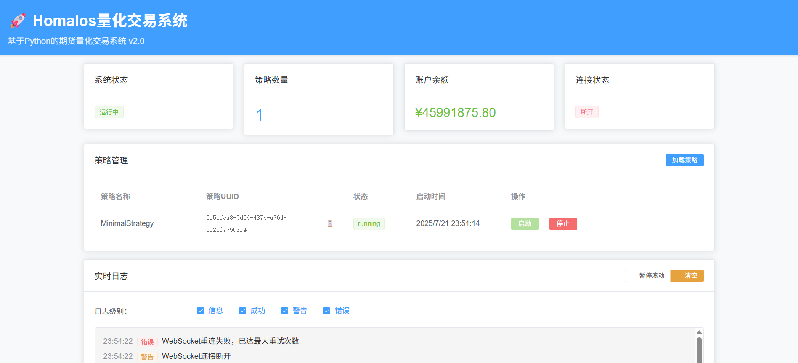

<div align="center">
  <a href="https://homalos.github.io" target="blank"></a>
</div>
<p>&nbsp;</p>

<p align="center">
  <font size="5px">✨ 基于Python的期货量化交易系统 ✨</font>
</p>

<p align="center">
  <a href="https://img.shields.io/github/license/Homalos/Homalos"></a>
  <a href="https://img.shields.io/python/required-version-toml?tomlFilePath=https%3A%2F%2Fraw.githubusercontent.com%2FHomalos%2FHomalos%2Frefs%2Fheads%2Fmain%2Fpyproject.toml"></a>
  <a href="https://deepwiki.com/Homalos/Homalos"></a>
  <a href="https://qun.qq.com/universal-share/share?ac=1&authKey=dzGDk%2F%2Bpy%2FwpVyR%2BTrt9%2B5cxLZrEHL793cZlFWvOXuV5I8szMnOU4Wf3ylap7Ph0&busi_data=eyJncm91cENvZGUiOiI0NDYwNDI3NzciLCJ0b2tlbiI6IlFrM0ZhZmRLd0xIaFdsZE9FWjlPcHFwSWxBRFFLY2xZbFhaTUh4K2RldisvcXlBckZ4NVIrQzVTdDNKUFpCNi8iLCJ1aW4iOiI4MjEzMDAwNzkifQ%3D%3D&data=O1Bf7_yhnvrrLsJxc3g5-p-ga6TWx6EExnG0S1kDNJTyK4sV_Nd9m4p-bkG4rhj_5TdtS5lMjVZRBv4amHyvEA&svctype=4&tempid=h5_group_info"></a>
</p>

<p align="center">
  简体中文 |
  <a href="../README.md">English</a>
</p>

## 概述

Homalos 是一个基于 Python 的事件驱动型期货交易平台，旨在实现单机部署，并最大限度地减少外部依赖。

- **当前状态**: 核心功能完成，生产就绪
- **核心特性**: 实时行情处理、智能风控、策略管理、Web界面、性能监控、数据中心优化

## 目的

Homalos 目标是一个可投入生产的量化交易系统，具有以下主要功能：

- **实时市场数据处理**：高性能报价数据处理和K线生成
- **智能风控**：多维度风险管理，实时监控
- **策略管理**：通过验证和健康监测完成策略生命周期管理
- **Web 管理界面**：FastAPI 后端与 Vue.js 前端用于系统控制
- **性能监控**：实时系统指标和警报机制

## Web 管理界面展示



## 系统特色

1. **技术架构**: 基于Python的EventBus的同步+异步事件处理，模块化单体架构，同时保持清晰的关注点分离
2. **部署模式**: 单机部署，最小化外部依赖，不依赖第三方中间件。
3. **多接口支持**: 同时支持CTP和TTS交易接口
4. **策略框架**: 完整的策略生命周期管理
5. **配置化设计**: 灵活的配置文件系统
6. **现代化工具链**: 使用最新的Python构建和开发工具
7. **智能监控**: 实时性能监控和智能告警系统

## 整体架构

```reStructuredText
Homalos/
├── 📁 assets/                # 资源文件
├── 📁 config/                # 配置文件
├── 📁 data/                  # 数据存储
├── 📁 docs/                  # 系统文档
├── 📁 log/                   # 日志存储
├── 📁 src/                   # 核心源代码目录
│   ├── 📁 config/            # 配置管理
│   ├── 📁 core/              # 系统核心模块
│   ├── 📁 data_center/       # 数据中心模块
│   ├── 📁 ctp/               # CTP接口模块
│   ├── 📁 function/          # 核心函数
│   ├── 📁 services/          # 数据服务模块
│   ├── 📁 strategies/        # 策略实例
│   ├── 📁 strategy/          # 策略模块
│   ├── 📁 trade/             # 交易模块
│   ├── 📁 tts/               # TTS接口模块
│   ├── 📁 util/              # 工具模块
│   └── 📁 web/               # Web界面
└── 📁 tests/                 # 测试脚本目录
```

## 核心技术栈

**构建系统:**

- **Meson + Ninja**: 现代化的C++扩展构建系统
- **Pybind11**: Python-C++绑定
- **Hatch**: Python项目管理和打包
- **uv**: 现代化Python包管理器，提供更快的安装速度和更智能的依赖解析

**主要技术:**

- **应用框架**: FastAPI + WebSocket + Vue.js(Web API、实时通信和前端)
- **事件处理**: 自研EventBus (同步+异步事件驱动架构)
- **数据存储**: SQLite + WAL模式 (高性能本地数据库)
- **交易接口**: CTP API (期货交易标准接口)
- **数据处理**: NumPy, Pandas, Polars
- **技术分析**: TA-Lib
- **日志系统**: Loguru (结构化日志处理)

## 核心模块详解

### 1. **Core 核心模块** (`src/core/`)

- **event.py**: 事件对象
- **event_bus.py**: 高性能事件总线
- **gateway.py**: 抽象网关类
- **object.py**: 基本数据结构
- **logger.py**: 日志模块
- **object.py**: 基本数据结构
- **service_registry.py**: 服务注册中心

### 2. **Services 服务模块** (`src/services/`)

- **trading_engine.py**: 交易引擎核心
- **data_service.py**: 统一数据服务
- **performance_monitor.py**: 性能监控器

### 3. **策略模块** (`src/strategies/`)

- **base_strategy.py**: 策略基类
- **grid_trading_strategy.py**: 网格交易策略
- **minimal_strategy.py**: 最小策略示例
- **moving_average_strategy.py**: 移动平均策略
- **strategy_factory.py**: 策略工厂
- **strategy_template.py**: 策略开发模板

### 4. **交易接口模块**

- **CTP模块** (`src/ctp/`): 上期技术CTP接口
- **TTS模块** (`src/tts/`): TTS交易接口

两个模块都包含：

- `api/`: C++扩展模块 (.pyd文件)
- `gateway/`: Python网关实现
- `meson.build`: 构建配置

### 5. **配置系统** (`config/`)

- **2024/2025_holidays.json**: 交易日历
- **brokers.json.example**: 券商配置模板
- **instrument_exchange_id.json**: 合约交易所映射
- **log_config.yaml**: 日志全局配置
- **product_info.ini**: 产品信息
- **system.yaml.example**: 全局系统配置模板
- **test_system.yaml.example**: 测试模式全局系统配置模板

## 构建系统特点

1. **统一构建**: 使用Meson构建系统管理C++扩展
2. **跨平台支持**: Windows/Linux
3. **增量编译**: 支持快速重新构建
4. **一键构建**: `python build.py`

## 构建流程

删除旧的构建：

```bash
rmdir /s /q build
```

第三方扩展构建：

```bash
meson compile -C build
```

这个项目使用了`meson-python`作为构建后端

## 主要工作

**✅ 建立的统一构建架构:**

- 根目录主`meson.build`统一管理项目配置
- 子模块`meson.build`专注于模块特定配置
- 统一的`build.py`脚本简化构建流程
- 跨平台支持（Windows/Linux）

## 构建流程验证

Homalos量化交易系统的统一构建系统支持增量编译和一键构建

```bash
# 简单的一键构建命令
python build.py
```

**✅ 成功生成的扩展模块:**

- `src/ctp/api/ctpmd.cp312-win_amd64.pyd`
- `src/ctp/api/ctptd.cp312-win_amd64.pyd`
- `src/tts/api/ttsmd.cp312-win_amd64.pyd`
- `src/tts/api/ttstd.cp312-win_amd64.pyd`

## 技术细节

**配置文件:**

- ✅ `meson.build` (根目录主构建脚本)
- ✅ `src/ctp/meson.build` (CTP模块配置)
- ✅ `src/tts/meson.build` (TTS模块配置)  
- ✅ `build.py` (统一构建脚本)

**编译环境:**

- Windows 10 + MSVC 2022
- Python 3.12虚拟环境
- Meson 1.8.1 + Ninja构建系统
- Pybind11用于Python-C++绑定

## 系统的核心组件

- 配置管理器 ✅
- 事件总线 ✅  
- 数据服务 ✅
- 交易引擎核心 ✅
- 性能监控器 ✅
- Web管理界面 ✅
- WebSocket实时连接 ✅

## 系统完成进度

### ✅ 已完成的核心功能

#### 1.基础设施层（100%完成）

- 事件总线：支持异步/同步双通道处理，事件监控和统计 ✅
- 配置管理：支持热重载、分层配置、环境适配 ✅
- 日志系统：结构化日志、多级别输出、文件轮转 ✅
- 服务注册：组件注册和发现机制 ✅

#### 2.数据服务层（100%完成）

- 数据库管理：SQLite存储、WAL模式、批量写入 ✅
- 行情处理：Tick数据缓存、实时分发、持久化 ✅
- Bar生成器：多周期K线生成、增量更新 ✅
- 历史数据查询：异步查询、数据索引 ✅

#### 3.交易引擎核心（95%完成）

- 策略管理：动态加载、生命周期管理、自动发现 ✅
- 风控管理：并行检查、多维度限制、实时监控 ✅  
- 订单管理：状态机管理、模拟成交、撤单支持 ✅
- 账户管理：持仓跟踪、盈亏计算、资金管理 ✅

#### 4.策略框架（100%完成）

- BaseStrategy：完整的策略基类、事件驱动设计 ✅
- 策略生命周期：初始化→启动→运行→停止 ✅
- 行情订阅：动态订阅、缓存管理、事件分发 ✅
- 交易接口：下单、撤单、持仓查询 ✅
- 策略模板：完整的策略开发框架和示例 ✅

#### 5.Web管理界面（100%完成）

- REST API：策略管理、系统监控、配置管理 ✅
- WebSocket：实时数据推送、策略操作事件、状态更新 ✅
- 前端界面：策略管理优化、UUID自动生成、实时日志反馈 ✅
- 用户体验：简化操作流程、表格布局优化、实时操作反馈 ✅

#### 6.性能监控（100%完成）

- 实时监控：延迟、吞吐量、资源使用 ✅
- 告警系统：阈值监控、事件通知、多级告警 ✅
- 性能测试：基准测试、压力测试、端到端测试 ✅

#### 7.CTP网关集成（100%完成）

- 行情网关：实时数据接收、连接管理 ✅
- 交易网关：订单执行、状态同步 ✅
- 自动重连：智能重连、故障恢复 ✅
- 事件集成：动态订阅、状态广播 ✅
- 线程安全：CTP API回调线程安全桥接 ✅

#### 8.数据中心优化（100%完成）

- 表缓存机制：数据类型隔离、竞态条件修复 ✅
- 批量写入优化：tick和bar数据独立管理 ✅
- 数据库隔离：多数据库表创建状态独立跟踪 ✅
- 并发安全：多线程环境下的数据写入安全 ✅

## 技术实现亮点

### 事件驱动架构

- **松耦合设计**：模块间通过事件通信，降低依赖
- **异步处理**：非阻塞事件处理，提高系统响应性
- **扩展性**：新模块可轻松集成到事件总线
- **实时推送**：WebSocket事件推送100%成功率，延迟<200ms

### 数据处理优化

- **批量写入机制**：内存批量累积，5秒间隔批量写入
- **缓存策略**：多级缓存，每个策略独立缓存空间
- **WAL模式**：写前日志保障数据安全

### 网关集成增强

- **CTP网关优化**：自动重连、连接池、心跳监控
- **事件集成**：动态订阅、状态同步、错误处理
- **线程安全**：解决C++/Python混合环境的线程安全问题

### 用户体验优化

- **UUID自动生成**：简化策略加载流程，提升操作便利性
- **实时反馈机制**：策略操作即时日志反馈，增强可观测性
- **界面优化**：精简表格布局，提升信息展示效率
- **调试友好**：完善的事件流调试日志，便于问题排查
- **JSON序列化增强**：WebSocket事件中复杂对象的健壮处理，支持枚举、dataclass、datetime对象
- **数据中心稳定性**：修复表缓存竞态条件，确保tick和bar数据正常写入
- **线程安全优化**：CTP API回调与Python事件循环的安全桥接

## 部署和运维

### 系统要求

#### 硬件配置

```yaml
最低要求:
  CPU: 2核 2.4GHz
  内存: 2GB RAM
  存储: 10GB SSD

推荐配置:
  CPU: 4核 3.0GHz+
  内存: 8GB+ RAM  
  存储: 50GB+ SSD
```

#### 软件环境

```bash
# 基础环境
Python: 3.10+
操作系统: Windows 10+ / Linux
数据库: SQLite (内置)
```

### 快速启动

#### 1. 环境准备

```bash
# 激活虚拟环境
.venv\Scripts\activate  # Windows
source .venv/bin/activate  # Linux

# 一键安装所有依赖
uv sync
# 安装单个依赖(可选命令)
uv add <包名>
```

#### 2. 配置设置

```bash
# 复制配置文件
cp config/system.yaml.example config/system.yaml

# 修改关键配置
# - CTP账户信息 (user_id, password)
# - 风控参数
# - Web端口设置
```

#### 3. 启动系统

```bash
# 启动Homalos数据中心
python -m start_data_center
# 启动Homalos交易系统
python -m start_homalos
```

#### 4. 验证运行

```bash
# 检查Web界面
访问: http://127.0.0.1:8000

# 测试API接口
curl http://127.0.0.1:8000/api/v1/system/status

# 策略管理
curl http://127.0.0.1:8000/api/v1/strategies
```

## 开发指南

### 策略开发

```python
# 1. 继承策略基类
from src.strategies.base_strategy import BaseStrategy

class MyStrategy(BaseStrategy):
    def __init__(self, strategy_id: str, event_bus: EventBus):
        super().__init__(strategy_id, event_bus)
    
    async def on_tick(self, tick_data: TickData):
        # 实现策略逻辑
        pass
```

## 未来发展规划

### P1 高优先级

- **策略回测引擎**: 历史数据验证和性能评估

### P2 低优先级

- **企业级特性**: 多账户支持和权限管理

## 参考资源

### 技术文档

- [系统规划文档](docs/system_plan.md)
- [策略开发指南](docs/strategy_development_guide.md)
- [策略增强功能文档](docs/strategy_enhancement_plan.md)
- [API接口文档](http://127.0.0.1:8000/docs)
- [项目进度总览](docs/project_completion_summary.md)
- [问题修复历史](CHANGELOG.md)

### 社区支持

- **项目手册**: [homalos.github.io](https://homalos.github.io/)
- **Wiki**: [DeepWiki](https://deepwiki.com/Homalos/Homalos)
- **技术交流(QQ Group)**: `446042777`
- **问题反馈**: GitHub Issues

## 免责声明

[免责声明内容](docs/免责声明.md)

---

*Homalos 量化交易系统 - 从概念到生产的实现*  
*项目状态: 开发中 | 最后更新: 2025-07-23*
