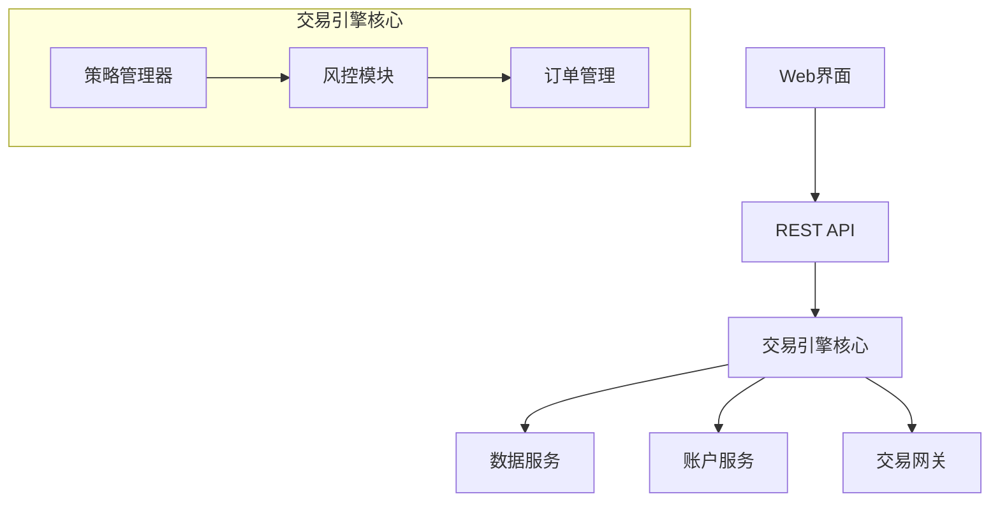

```mermaid
graph TD
    UI[Web界面] --> API[REST API]
    API --> Engine[交易引擎核心]
    Engine --> DataService[数据服务]
    Engine --> Account[账户服务]
    Engine --> Gateway[交易网关]
    
    subgraph "交易引擎核心"
        Strategy[策略管理器]
        Risk[风控模块] 
        Order[订单管理]
        Strategy --> Risk
        Risk --> Order
    end
```

